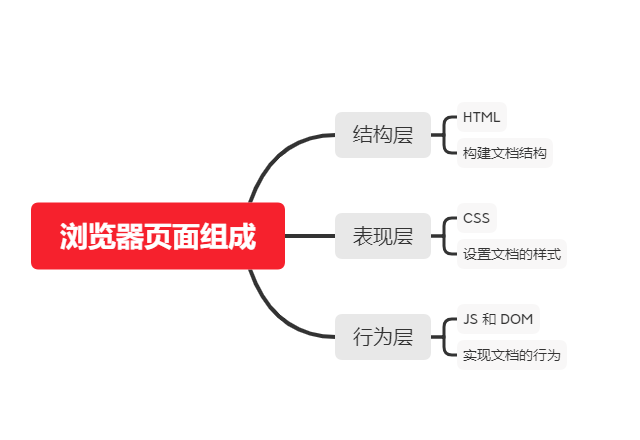
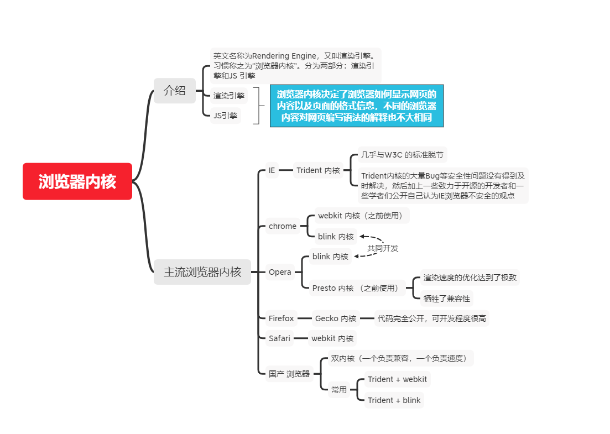

## HTML

### HTML5

#### 语义

* HTML5 中的区块和段落元素

  ~~~
  <section>
  <article>
  <nav>
  <header>
  <footer>
  <aside>
  <hgroup>
  ~~~

* HTML5 中的音频和视频

  ~~~
  <audio>
  <video>
  ~~~

* 表单的改进

  ~~~
  一些input的元素type属性值
  新的<output>元素
  ~~~

* 新的语义元素

  ~~~
  <mark>
  <figure>
  <figcaption>
  <data>
  <time>
  <output>
  <progress>
  <meter>
  <main>
  ~~~

* iframe  的改进

  ~~~
  新的属性值 sandbox,seamless,srcdoc
  ~~~

* MathML

  ~~~
  允许直接嵌入数学公式
  ~~~

* 

#### 通信

* Web Sockets
* Server-sent events
* WebRTC

#### 离线（存储）

* 客户端会话和持久化存储

  ~~~
  localStorage
  sessionStorage
  ~~~

* 在Web 应用程序中使用文件

  ~~~
  <input type="file"/>
  ~~~

  

#### 多媒体

* 使用音频

  ~~~
  <audio>
  ~~~

* 使用视频

  ~~~
  <video>
  问题1：如何为你的视频添加字幕：<track> 元素支持字幕和章节
  问题2：字幕格式：WebVVT格式，后缀为.vtt
  	WebVTT 是一个格式，用来编写文本文件，这个文本文件包含了众多的字符串，这些字符串会带有一些元数据，它们可以用来描述这个字符串将会在视频中显示的时间，甚至可以用来描述这些字符串的样式以及定位信息。这些字符串叫做 cues ，你可以根据不同的需求来显示不同的样式
  	
  问题3：你是否已经掌握将图像，视频和音频嵌入到网页上的诀窍？
  ~~~

* Camera API

* Track

  ~~~
  <track> 元素支持字幕和章节
  ~~~

* WebVTT

  ~~~
  WebVTT 一个文本轨道格式
  ~~~

#### 嵌入技术

* 从对象到iframe-其他嵌入技术

  ~~~
  <iframe>：用于嵌入网页
  <embed><object>：这两个元素允许您嵌入PDF，SVG甚至flash
  ~~~

  

#### 3D 图像 & 效果

* 绘制Canvas

* <canvas> 对应的API

* 3D 图像功能 WebGL

* SVG

  ~~~
  一个基于XML 的可以直接嵌入到HTML中的矢量图像格式
  ~~~

  

#### 性能 & 集成

* Web Workers

* XMLHttpRequest

  ~~~
  允许异步读取页面的某些部分，允许其显示动态内容，根据时间和用户行为而有所不同，这是在ajax背后的技术
  ~~~

* 即时编译的JavaScript 引擎

* History API

  ~~~
  允许对浏览器历史记录进行操作
  ~~~

  

* contentEditable 属性

  ~~~
  可以将网页转换为完整且快速的富文本编辑器
  
  

  	This text can be edited by the user.
  

  支持document.execCommand 方法
  ~~~

  

* 拖放

  ~~~
  HTML5 的拖放API 能够支持在网站内部和网站之间拖放项目
  典型的拖拽操作：用户选中一个可拖拽的draggable元素，并将其拖拽（鼠标不放开）到一个可放置的droppable 元素，然后释放鼠标
  触发事件：drag和dragover
  元素如何是可拖动的：元素可拖动需添加draggable属性和ondragstart事件
  
  ~~~

  

* HTML中的焦点管理

* 基于Web的协议处理程序

* requestAnimationFrame

* 全屏 API

* 指针锁定API

* 在线和离线事件

#### 设备访问

* 使用 Cameras API
* 触控事件
* 使用地理位置定位
* 检测设备方向
* 指针锁定API